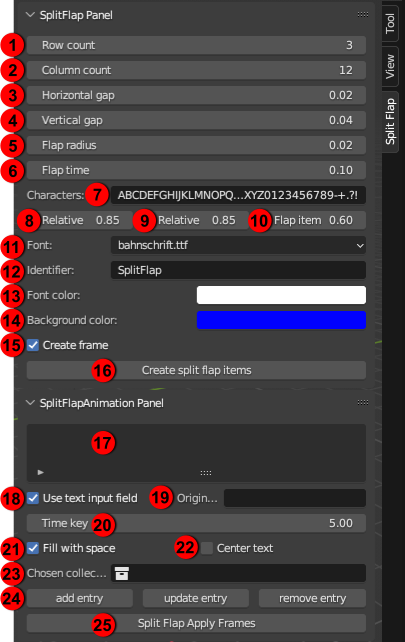

# License
This work is licensed under the MIT license.

# Example


# Installation
The folder ./SplitFlapTable contains all the necessary files. Make a zip archive from it and you are ready to 
install in in the Blender UI: 
`Menu > Edit > Preferences > Addons > Install...`.

# Requirements
The addon uses the python module pillow to generate the texture images. The module has to be installed to the 
python instance that ships with the Blender installation. For this, open a command line where the binary is located 
(usually `<Blender version>/python/bin`) and execute the following python call:
```
python -m pip install pillow
```
You may need write rights in the Blender installation directory to complete the module installation successfully.

# Usage
- Open the addon panels in Blender 3D View pressing [N]
- Edit the upper panel settings to create a set of split flap items from the addon template, specify the available characters etc.
- Define the animation using the lower panel: enter time keys in seconds and the texts to display
- Then hit the button to create the animation using the flip speed defined during the split flap item creation
Some time keys may not be allowed as the switch from one text to the next cannot be completed in the meantime.

## UI



Meaning and usage of the UI elements:

1. Number of split flap items in horizontal direction
2. Number of split flap items in vertical direction
3. Space between neighbour split flap items in horizontal direction
4. Space between neighbour split flap items in vertical direction
5. Radius of the circle where all character cards of the split flap item are attached to
6. Time in seconds to switch from one character to the next one in the character order
7. Characters to be included in the split flap item (and implicitly how many character cards should be generated)
8. Share of the card width a character should fill at most
9. Share of the card height (sum of upper and lower part) a character should fill at most
10. Ratio of the card width vs. card height (sum of upper and lower part)
11. System font to select for the character texture
12. Prefix for auto-generated objects and their collection
13. Colour used for the characters
14. Colour used for the background of the character cards
15. Activate to generate a black metallic frame object around the split flap item table
16. Generate the split flap item table according to the settings above
17. List of split flap item states (text to display, time and collection of split flap items) previously entered through the UI items below
18. Activate to enter the text to display directly in the input field next to it (does not allow multi-line text) / use text data block input otherwise
19. Either input field for text to display or list of available text data blocks to take the text from (select one of them)
20. Time in seconds the animation to  display the text should start (text is already on display if time == 0)
21. Activate to append space (" ") character to text to display if shorter than possible by the number of split flap items
22. Activate to distribute added space characters such that the text is centered (currently works only for a single row)
23. List of available split flap collections to use for displaying text
24. Save the entered settings to the list of element 17 / Update an existing setting by first selecting it in element 17, editing data in the single UI items and then press this button / Remove a setting previously selected in element 17
25. Generate the animation according to the settings saved in element 17

## Enter text to be displayed
Two separate ways of entering the text to be displayed are offered. This is mainly due to limitations in the Blender UI 
concerning multi-line text.

1. Enter the text directly in the input field of the panel added by this Blender addon: No multi-line text
2. Use Text data blocks for multi-line text: Open the Text Editor, add a new data block by "+ New", name it, enter your text, select the data block later in UI element 19

## Delete items generated through the addon
The addon relies on some invariants, especially the IDs of template 3D objects and materials it uses to generate the final split flap items.
As Blender resolves naming conflicts by appending suffixes, this may disturb the correct function of the addon. If you delete items created through the addon, the .blend file should be saved and reloaded to clear the Blender ID cache. Only then the templates can be imported again without seeing their IDs altered.


# Compatibility
Developed using Blender 3.4. Tested with Blender 4.0, 4.2.