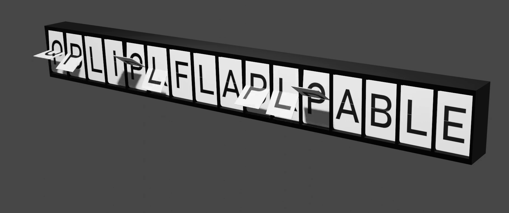

# License
This work is licensed under the MIT license.

# Example



# Installation
The folder ./SplitFlapTable contains all the necessary files. Make a zip archive from it and you are ready to 
install in in the Blender UI: 
`Menu > Edit > Preferences > Addons > Install...`.

# Requirements
The addon uses the python module pillow to generate the texture images. The module has to be installed to the 
python instance that ships with the Blender installation. For this, open a command line where the binary is located 
(usually `<Blender version>/python/bin`) and execute the following python call:
```
python -m pip install pillow
```

# Usage
TODO
<!--The addon creates its own menus in the Blender 3D View accessible -->

# Compatibility
Developed using Blender 3.4