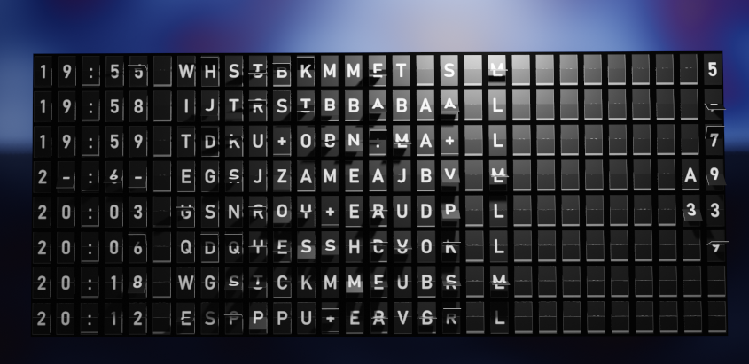

# License
This work is licensed under the MIT license.

# Example



# Installation
The folder ./SplitFlapTable contains all the necessary files. Make a zip archive from it and you are ready to 
install in in the Blender UI: 
`Menu > Edit > Preferences > Addons > Install...`.

# Requirements
The addon uses the python module pillow to generate the texture images. The module has to be installed to the 
python instance that ships with the Blender installation. For this, open a command line where the binary is located 
(usually `<Blender version>/python/bin`) and execute the following python call:
```
python -m pip install pillow
```

# Usage
- Open the addon panels in Blender 3D View pressing [N]
- Edit the upper panel settings to create a set of split flap items from the addon template, specify the available characters etc.
- Define the animation using the lower panel: enter time keys in seconds and the texts to display
- Then hit the button to create the animation using the flip speed defined during the split flap item creation
Some time keys may not be allowed as the switch from one text to the next cannot be completed in the meantime.

# Compatibility
Developed using Blender 3.4